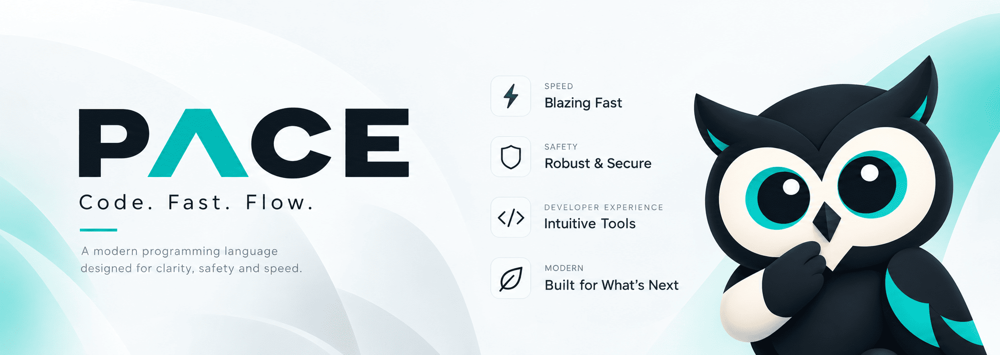

<div align="center">
  

  # Pace Language
  *A fast, memory-safe, statically typed programming language.*
</div>

---

## ⚡ Overview
This repository contains the complete Pace compiler, standard library, and tooling ecosystem.

## 💻 Syntax Example

```pace
interface Counter {
    func increment();
    func getValue() -> Int;
}

class SimpleCounter implement Counter {
    private var count: Int = 0;

    func init() {}

    func increment() {
        self.count = self.count + 1;
    }

    func getValue() -> Int {
        return self.count;
    }
}

async func main() {
    let counter = SimpleCounter();
    counter.increment();
    counter.increment();
    
    let value = counter.getValue();
    print("Counter value: ${value}");
}
```

## 🚀 Core Features
- **Variables**: `let` (immutable), `var` (mutable), `const` (compile-time constant).
- **Concurrency**: First-class support for `async`, `await`, `actor`, and `spawn`.
- **Null Safety**: Optional types `T?` with explicit `null` checking.
- **Classes & Interfaces**: Full object-oriented features with `class`, `struct`, and `interface`.

## 📊 Benchmarks

Pace is built for speed, generating highly optimized native code via Cranelift. Below are the benchmark results comparing Pace to other popular languages.

*Tested on **AMD Ryzen 7 7730U with Radeon Graphics**, **15GiB RAM**, **Linux x86_64**.*

**Tool Versions:**
- **Rust**: rustc 1.98.0
- **Zig**: 0.16.0
- **Go**: go1.26.6
- **Java**: javac 21.0.12
- **Dart**: 3.13.1
- **Python**: 3.14.4
- **Pace**: 0.1.0

### ACTORS (N=100K MSGS)

| Language | Execution Time (Median) | Peak Memory | CPU Usage | Compile Time |
| :--- | :--- | :--- | :--- | :--- |
| **Pace** | $\color{#ca8a04}{\mathbf{1.154 ms}}$ | 13.98 MB | 92% | 1011.398 ms |


### CLASSES (N=1M)

| Language | Execution Time (Median) | Peak Memory | CPU Usage | Compile Time |
| :--- | :--- | :--- | :--- | :--- |
| Rust | $\color{#16a34a}{\text{0.854 ms}}$ | 13.98 MB | 89% | 76.795 ms |
| Go | $\color{#16a34a}{\text{2.238 ms}}$ | 13.98 MB | 106% | 41.252 ms |
| Dart | $\color{#ca8a04}{\text{4.628 ms}}$ | 14.10 MB | 98% | 1569.125 ms |
| Java | $\color{#ca8a04}{\text{39.049 ms}}$ | 46.21 MB | 120% | 498.798 ms |
| **Pace** | $\color{#dc2626}{\mathbf{53.251 ms}}$ | 48.92 MB | 100% | 1032.603 ms |
| Python | $\color{#dc2626}{\text{166.099 ms}}$ | 14.10 MB | 100% | N/A |


### FIBONACCI (N=35)

| Language | Execution Time (Median) | Peak Memory | CPU Usage | Compile Time |
| :--- | :--- | :--- | :--- | :--- |
| Zig | $\color{#16a34a}{\text{23.420 ms}}$ | 14.10 MB | 99% | 14537.095 ms |
| Rust | $\color{#16a34a}{\text{24.276 ms}}$ | 14.10 MB | 99% | 92.345 ms |
| Go | $\color{#ca8a04}{\text{46.926 ms}}$ | 14.10 MB | 101% | 36.654 ms |
| Dart | $\color{#ca8a04}{\text{63.769 ms}}$ | 14.10 MB | 100% | 1501.292 ms |
| **Pace** | $\color{#ca8a04}{\mathbf{64.059 ms}}$ | 14.10 MB | 100% | 1063.789 ms |
| Java | $\color{#dc2626}{\text{64.682 ms}}$ | 39.71 MB | 108% | 456.196 ms |
| Python | $\color{#dc2626}{\text{976.746 ms}}$ | 14.10 MB | 100% | N/A |


### LOOPS (N=10M)

| Language | Execution Time (Median) | Peak Memory | CPU Usage | Compile Time |
| :--- | :--- | :--- | :--- | :--- |
| Zig | $\color{#16a34a}{\text{0.501 ms}}$ | 14.10 MB | 86% | 14979.767 ms |
| Rust | $\color{#16a34a}{\text{0.826 ms}}$ | 14.10 MB | 91% | 67.915 ms |
| Go | $\color{#ca8a04}{\text{4.479 ms}}$ | 14.10 MB | 107% | 40.751 ms |
| **Pace** | $\color{#ca8a04}{\mathbf{6.742 ms}}$ | 14.10 MB | 98% | 991.648 ms |
| Dart | $\color{#ca8a04}{\text{9.313 ms}}$ | 14.10 MB | 99% | 1572.297 ms |
| Java | $\color{#dc2626}{\text{35.269 ms}}$ | 40.02 MB | 115% | 507.279 ms |
| Python | $\color{#dc2626}{\text{405.616 ms}}$ | 14.10 MB | 100% | N/A |


### MAPS (N=10K)

| Language | Execution Time (Median) | Peak Memory | CPU Usage | Compile Time |
| :--- | :--- | :--- | :--- | :--- |
| Zig | $\color{#16a34a}{\text{1.196 ms}}$ | 14.10 MB | 94% | 15557.386 ms |
| Rust | $\color{#16a34a}{\text{1.960 ms}}$ | 14.10 MB | 93% | 207.703 ms |
| Go | $\color{#ca8a04}{\text{2.548 ms}}$ | 14.10 MB | 106% | 38.372 ms |
| **Pace** | $\color{#ca8a04}{\mathbf{4.338 ms}}$ | 14.10 MB | 97% | 1086.275 ms |
| Dart | $\color{#ca8a04}{\text{4.349 ms}}$ | 14.10 MB | 98% | 1608.123 ms |
| Python | $\color{#dc2626}{\text{14.676 ms}}$ | 14.10 MB | 98% | N/A |
| Java | $\color{#dc2626}{\text{47.274 ms}}$ | 42.24 MB | 110% | 545.345 ms |


### STARTUP TIME

| Language | Execution Time (Median) | Peak Memory | CPU Usage | Compile Time |
| :--- | :--- | :--- | :--- | :--- |
| Zig | $\color{#16a34a}{\text{0.394 ms}}$ | 14.10 MB | 83% | 170.767 ms |
| Rust | $\color{#16a34a}{\text{0.867 ms}}$ | 14.10 MB | 91% | 64.178 ms |
| **Pace** | $\color{#ca8a04}{\mathbf{1.079 ms}}$ | 14.10 MB | 92% | 1085.965 ms |
| Go | $\color{#ca8a04}{\text{1.779 ms}}$ | 14.10 MB | 105% | 65.829 ms |
| Dart | $\color{#ca8a04}{\text{2.773 ms}}$ | 14.10 MB | 98% | 1640.136 ms |
| Python | $\color{#dc2626}{\text{13.157 ms}}$ | 14.10 MB | 98% | N/A |
| Java | $\color{#dc2626}{\text{30.412 ms}}$ | 39.29 MB | 116% | 500.709 ms |


### STRING CONCAT (N=10K)

| Language | Execution Time (Median) | Peak Memory | CPU Usage | Compile Time |
| :--- | :--- | :--- | :--- | :--- |
| Rust | $\color{#16a34a}{\text{0.899 ms}}$ | 14.10 MB | 91% | 90.514 ms |
| **Pace** | $\color{#16a34a}{\mathbf{1.535 ms}}$ | 14.10 MB | 95% | 1135.944 ms |
| Go | $\color{#ca8a04}{\text{1.686 ms}}$ | 14.10 MB | 107% | 42.573 ms |
| Dart | $\color{#ca8a04}{\text{3.343 ms}}$ | 14.10 MB | 98% | 1579.850 ms |
| Python | $\color{#dc2626}{\text{13.205 ms}}$ | 14.10 MB | 98% | N/A |
| Java | $\color{#dc2626}{\text{30.331 ms}}$ | 39.85 MB | 121% | 492.795 ms |

*Legend: $\color{#16a34a}{\text{Top Tier}}$ | $\color{#ca8a04}{\text{Average}}$ | $\color{#dc2626}{\text{Slowest}}$*
